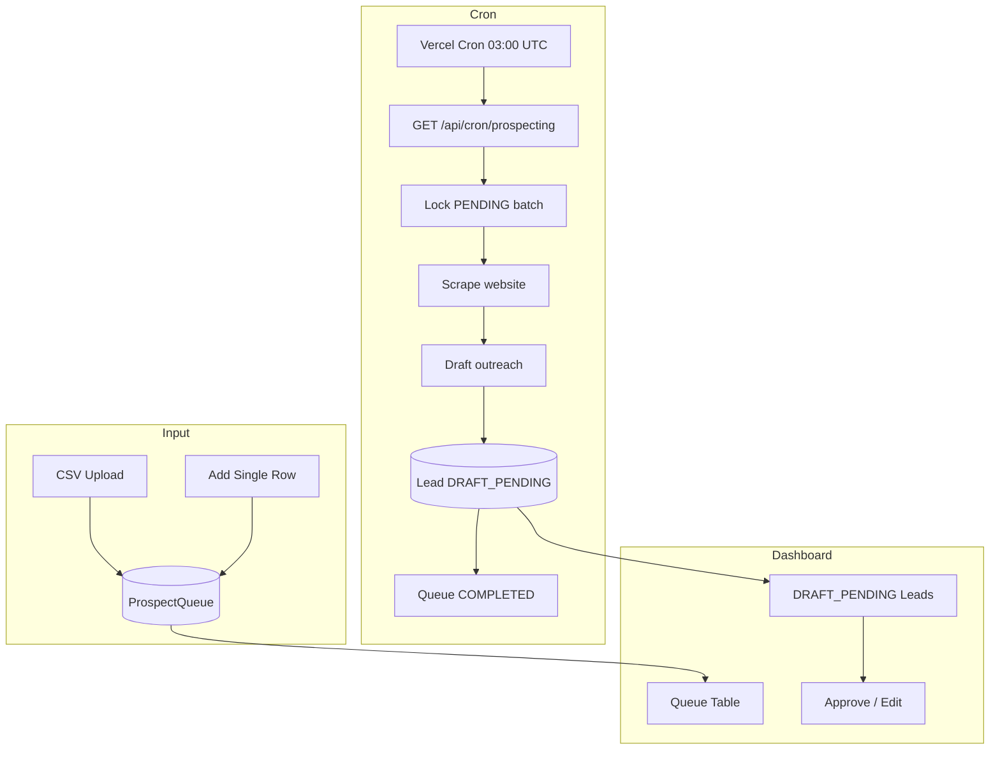

# Automation Dashboard and Prospecting Pipeline

## Enhancement Summary

**Deepened on:** 2026-03-16  
**Sections enhanced:** Schema, API, Vercel, Env, UI, Tests, Dependencies  
**Research agents used:** framework-docs-researcher, best-practices-researcher, security-sentinel, performance-oracle, architecture-strategist  
**Learnings applied:** vitest-database-url-not-loaded, typescript-prisma-contract-drift

### Key Improvements

1. **Atomic queue locking:** Use `SELECT ... FOR UPDATE SKIP LOCKED` to prevent concurrent cron runs from claiming the same prospects.
2. **CRON_SECRET validation:** Use `crypto.timingSafeEqual()` to avoid timing attacks; reject when secret is empty.
3. **Tenant isolation:** Resolve `clientId` from Clerk org only—never trust client-supplied `clientId` for auth.
4. **CSV security:** Papa Parse + Zod; enforce 5MB max, row limit (e.g. 10,000), formula sanitisation; validate columns.
5. **Batch size formula:** `N * 40s < timeout`; for 60s use N=2, for 300s use N=5–7; add `@@index([status, createdAt])` he implementation follows “order by latest” (DESC),
6. **Service layer:** Thin route handlers; all logic in `outbound.service`, `lead.service.createFromOutbound`, `scraper.service`.
7. **Component splits:** Queue/Leads pages ≤150 lines; extract `QueueTable`, `QueueUploadForm`, `LeadsTable`, `LeadDetailCard` under `_components/`.
8. **Vitest env:** Ensure `import "dotenv/config"` at top of `vitest.config.ts` (see `docs/solutions/integration-issues/vitest-database-url-not-loaded-testing-20260316.md`).

### New Considerations Discovered

- **Vercel Hobby plan:** Cron can run only once per day; hourly (`0` * * * *) fails deployment on Hobby.
- **Fluid Compute:** Enabled by default (April 2025); increases max duration (300s default, 800s max on Pro).
- **URL SSRF:** Validate `websiteUrl`—block private IPs, localhost; prefer `https` only.
- **proxy.ts vs middleware.ts:** Next.js expects `middleware.ts`; rename so Clerk protects dashboard routes.

---

## What We're Building

A full automation flow: users populate a **ProspectQueue** (CSV upload or single-row form), a **Vercel cron job** processes batches (scrape → draft outreach → Lead), and a **dashboard** lets users review, edit, and approve DRAFT_PENDING emails before dispatch. Batch size and function timeout are configurable via ENV to avoid Vercel limits.

---

## Key Decisions


| Decision                                                                         | Rationale                                                                                        |
| -------------------------------------------------------------------------------- | ------------------------------------------------------------------------------------------------ |
| **QueueStatus**: PENDING, PROCESSING, COMPLETED, FAILED, CANCELED (omit STARTED) | Simpler: PROCESSING = locked + scraping. STARTED adds no value.                                  |
| **Cron path**: `app/api/cron/prospecting/route.ts`                               | Matches user spec; distinct from future `outbound` routes.                                       |
| **Batch size + maxDuration via ENV**                                             | `PROSPECTING_BATCH_SIZE` (default 5), `CRON_MAX_DURATION_SECONDS` (default 60, up to 300 on Pro) |
| **CRON_SECRET** in `Authorization` header                                        | Vercel passes this when triggering cron; validate before processing.                             |
| **Order by latest**                                                              | `ORDER BY createdAt DESC` for pending prospects (user spec).                                     |
| **Sequential processing**                                                        | Avoid rate-limiting OpenAI/Firecrawl; process one prospect at a time within the batch.           |
| **CSV columns**: `businessName`, `websiteUrl`, `address?`                        | Minimal required set; address optional for display.                                              |
| **Dashboard under** `app/(marketing)/dashboard/`                                 | Reuse existing layout; add automation sub-routes.                                                |


---

## Schema Changes

**File:** [prisma/schema.prisma](prisma/schema.prisma)

- Add `CANCELED` to `QueueStatus` enum (current: PENDING, PROCESSING, COMPLETED, FAILED).
- Run `bun run prisma migrate dev` (or `db push` for dev) after change.

```prisma
enum QueueStatus {
  PENDING
  PROCESSING
  COMPLETED
  FAILED
  CANCELED
}
```

ProspectQueue model already has `clientId`, `leadId`, `businessName`, `websiteUrl`, `status`, `attempts`, `lastAttemptAt`, `errorMessage`. No further model changes.

### Research Insights

**Index for** he implementation follows “order by latest” (DESC), **claim:** Add composite index for atomic claim queries:

```prisma
@@index([status, createdAt])
```

Use for `WHERE status = 'PENDING' ORDER BY created_at ASC` when claiming batch. Prevents full table scan.

**References:** `docs/solutions/integration-issues/typescript-prisma-contract-drift-chatbot-stack-20260316.md` — ensure Prisma singleton is stable; avoid `InputJsonValue` drift when persisting JSONB.

---

## API Endpoints


| Method | Path                              | Purpose                                                         |
| ------ | --------------------------------- | --------------------------------------------------------------- |
| GET    | `/api/cron/prospecting`           | Vercel cron: fetch batch, lock, process, update queue + Lead    |
| GET    | `/api/prospect-queue`             | List queue items (tenant-scoped; paginated)                     |
| POST   | `/api/prospect-queue`             | Add single row (body: `businessName`, `websiteUrl`, `address?`) |
| POST   | `/api/prospect-queue/upload`      | CSV upload → bulk insert                                        |
| PATCH  | `/api/prospect-queue/[id]`        | Edit row                                                        |
| DELETE | `/api/prospect-queue/[id]`        | Delete row (or soft-cancel via status)                          |
| GET    | `/api/leads?status=DRAFT_PENDING` | List leads for approval                                         |
| PATCH  | `/api/leads/[id]`                 | Approve/edit draft, optionally trigger dispatch                 |


**Cron route behaviour:**

- Validate `Authorization: Bearer <CRON_SECRET>`.
- Fetch up to `PROSPECTING_BATCH_SIZE` rows with `status = PENDING`, ordered by `createdAt DESC`.
- Atomic update: set `status = PROCESSING` to lock.
- For each: scrape → draft outreach → create/update Lead (DRAFT_PENDING) → set queue `COMPLETED` or `FAILED`.
- Return JSON: `{ message, processedCount }` or `{ message: 'Queue is empty...' }`.

### Research Insights

**Atomic claim:** Use `SELECT ... FOR UPDATE SKIP LOCKED` to prevent two cron invocations from claiming the same rows:

```ts
// lib/services/outbound.service.ts
async claimQueueBatch(batchSize: number): Promise<ProspectQueue[]> {
  return prisma.$transaction(async (tx) => {
    const items = await tx.$queryRaw<ProspectQueue[]>`
      SELECT * FROM prospect_queue
      WHERE status = 'PENDING'
      ORDER BY created_at ASC
      LIMIT ${batchSize}
      FOR UPDATE SKIP LOCKED
    `;
    if (items.length === 0) return [];
    await tx.prospectQueue.updateMany({
      where: { id: { in: items.map((i) => i.id) } },
      data: { status: "PROCESSING", lastAttemptAt: new Date() },
    });
    return items;
  });
}
```

**Service layer:** Route handlers should call `outboundService.processQueue()` only; all orchestration (scrape → create Lead → draft) lives in `outbound.service.ts`. Add `lead.service.createFromOutbound()` instead of duplicating Prisma logic.

**Tenant isolation:** Resolve `clientId` from Clerk org (`auth().orgId` → `Client.clerkOrganizationId`). Never trust client-provided `clientId` for authorization. Enforce in all ProspectQueue and Lead reads/writes.

**CRON_SECRET validation:** Use `crypto.timingSafeEqual()` to avoid timing attacks; return 401 when secret is missing or invalid.

**CSV upload:** Prefer `POST /api/prospect-queue/bulk` for batch; route name `upload` is ambiguous. Use FormData with `req.formData()`; parse server-side with Papa Parse.

**URL validation:** Block private IPs, localhost (SSRF); use `z.string().url().max(2048)`; prefer `https` only.

---

## Vercel Configuration

**File:** `vercel.json` (create at project root)

```json
{
  "crons": [
    {
      "path": "/api/cron/prospecting",
      "schedule": "0 3 * * *"
    }
  ]
}
```

Schedule: daily at 03:00 UTC. Users can change to hourly (`0 * * * *`) for more throughput.

---

## Environment Variables


| Variable                    | Purpose                    | Default          |
| --------------------------- | -------------------------- | ---------------- |
| `CRON_SECRET`               | Auth for cron route        | Required in prod |
| `PROSPECTING_BATCH_SIZE`    | Max prospects per cron run | 5                |
| `CRON_MAX_DURATION_SECONDS` | Route `maxDuration`        | 60 (300 on Pro)  |


Document in `.env.example`.

---

## UI Components

**Dashboard routes:**

- `app/(marketing)/dashboard/automation/page.tsx` — Automation hub
- `app/(marketing)/dashboard/automation/queue/page.tsx` — Queue table + CSV upload + add-one form
- `app/(marketing)/dashboard/automation/leads/page.tsx` — DRAFT_PENDING leads; review, edit, approve

**Queue page:**

- CSV upload (parse client-side or server action; validate columns)
- Form: businessName, websiteUrl, address (optional) → POST `/api/prospect-queue`
- Table: list queue items with status, actions (Edit, Delete/Cancel)
- Empty state: "Queue is empty. No prospects to process." (matches cron response)

**Leads page:**

- Table of DRAFT_PENDING leads with draftSubject, draftBody
- Edit inline or modal
- Approve → PATCH lead (e.g. status → CONTACTED when dispatch is implemented later)

**Shared:**

- Use Typography components, existing Button/Input/Select
- Toast for success/error (e.g. "Batch processed successfully", "Queue is empty")

---

## Test Strategy

**TDD order:** Write failing tests before implementation.

1. **Schema:** Extend `tests/unit/db/prospect-queue-schema.test.ts` — assert CANCELED exists and transitions.
2. **Cron route:** `tests/unit/api/cron-prospecting.test.ts` — mock Prisma, Firecrawl, Gemini; assert auth, batch limit, status transitions, empty-queue response.
3. **Queue API:** `tests/unit/api/prospect-queue.test.ts` — CRUD, CSV parse validation.
4. **Leads API:** `tests/unit/api/leads-draft.test.ts` — list DRAFT_PENDING, PATCH approve.
5. **E2E:** `tests/e2e/automation-dashboard.spec.ts` — Playwright: seed data, upload CSV, add row, view table, edit, delete; optionally trigger cron (or mock) and verify queue/lead state.
6. **Seed:** Extend `prisma/seed.ts` with ProspectQueue rows for E2E (PENDING, COMPLETED samples).

---

## Data Flow




---

## File Summary


| Category  | Files                                                                                          |
| --------- | ---------------------------------------------------------------------------------------------- |
| Schema    | `prisma/schema.prisma` (add CANCELED)                                                          |
| Cron      | `app/api/cron/prospecting/route.ts`                                                            |
| Queue API | `app/api/prospect-queue/route.ts`, `.../upload/route.ts`, `.../[id]/route.ts`                  |
| Leads API | `app/api/leads/route.ts`, `app/api/leads/[id]/route.ts`                                        |
| UI        | `app/(marketing)/dashboard/automation/queue/page.tsx`, `.../leads/page.tsx`, shared components |
| Config    | `vercel.json`                                                                                  |
| Env       | `.env.example`                                                                                 |
| Tests     | `tests/unit/db/`, `tests/unit/api/`, `tests/e2e/automation-dashboard.spec.ts`                  |
| Seed      | `prisma/seed.ts` (ProspectQueue rows)                                                          |


---

## Open Questions (Resolved)

- **STARTED vs PROCESSING:** Resolved — omit STARTED; use PROCESSING for locked+scraping.

---

## Dependencies

- Existing: Prisma, Zod, AI SDK, Firecrawl (if already added per outbound plan)
- CSV parsing: Use **Papa Parse** for real-world CSV (quoted fields, embedded newlines). Native `split` fails for quoted commas. `bun add papaparse`.

### Research Insights

**CSV validation:** Zod schema per row; validate headers against required columns; enforce max file size (5MB), row limit (10,000); sanitise formula-triggering characters.

---

## Security Checklist (Pre-Deploy)

- `CRON_SECRET` validated with `crypto.timingSafeEqual`; 401 when missing or invalid
- Tenant `clientId` resolved from Clerk org for all dashboard APIs; never from request body/query
- CSV: max size 5MB, row limit 10,000, schema validation, formula sanitisation
- URL validation: `z.string().url()`, max 2048 chars, SSRF checks (block private IPs, localhost)
- `.env.example` updated with `CRON_SECRET`, `FIRECRAWL_API_KEY`
- No secrets in error responses or logs

---

## Completion Gates

- `bun run build` passes
- `bun run test` (Vitest) passes
- `bun run test:e2e` (Playwright) passes with seeded automation data
- Manual: upload CSV, add row, view/edit/delete in dashboard; cron returns expected JSON

