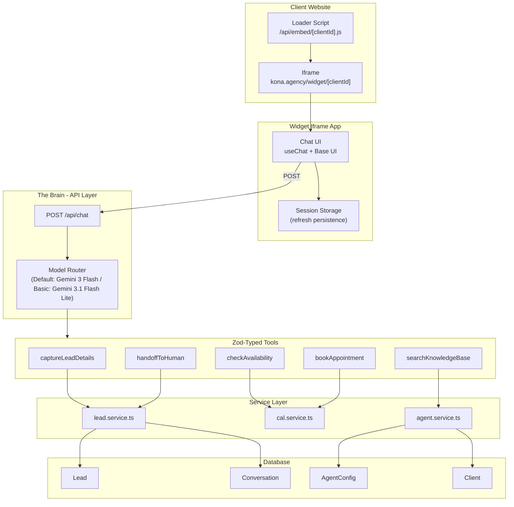

# Chat Widget Brain - Brainstorm Design

## 1. What We're Building

An AI-powered chat widget that GRAFT.TODAYclients embed on their websites. When a visitor chats, the LLM naturally gathers their details, answers questions from the client's knowledge base, checks calendar availability, and books appointments -- all through tool calling under the hood. The visitor sees a fluid conversation with subtle tool status indicators; the agency admin sees captured leads and full transcripts.

---

## 2. Architecture Overview




---

## 3. The Brain: `app/api/chat/route.ts`

### 3.1 Core Pattern

Uses AI SDK v6's `createUIMessageStream` for multi-step orchestration with different models per step.

```typescript
import { google } from '@ai-sdk/google';
import { createUIMessageStream, createUIMessageStreamResponse, streamText, convertToModelMessages, stepCountIs } from 'ai';
import { allTools } from '@/lib/ai/tools';
import { agentService } from '@/lib/services/agent.service';
import { conversationService } from '@/lib/services/conversation.service';
import { buildSystemPrompt } from '@/lib/ai/system-prompt';

export async function POST(req: Request) {
  const { messages, clientId } = await req.json();
  
  // 1. Resolve tenant + load AgentConfig
  const config = await agentService.getConfig(clientId);
  
  // 2. Build system prompt from config
  const systemPrompt = buildSystemPrompt(config);
  
  // 3. Stream with Gemini 3 Flash
  const stream = createUIMessageStream({
    execute: async ({ writer }) => {
      const result = streamText({
        model: google('gemini-3-flash-preview'),
        system: systemPrompt,
        messages: await convertToModelMessages(messages),
        stopWhen: stepCountIs(5),
        tools: allTools,
      });
      writer.merge(result.toUIMessageStream());
    },
    onFinish: async ({ messages: finalMessages }) => {
      await conversationService.save(clientId, finalMessages);
    },
  });
  
  return createUIMessageStreamResponse({ stream });
}
```

### 3.2 Tiered Model Router (Google Gemini)

Provider: `@ai-sdk/google` (needs installing, replaces `@ai-sdk/openai`). Env var: `GOOGLE_GENERATIVE_AI_API_KEY`.

The `selectModel` function picks the right Google model based on task complexity:

- **Default - Gemini 3 Flash** (`gemini-3-flash-preview`): Handles everything -- lead capture, scheduling, booking, general conversation. Strong reasoning + tool calling at Flash-tier cost. Used for all tools except pure knowledge base retrieval.
- **Basic - Gemini 3.1 Flash Lite** (`gemini-3.1-flash-lite-preview`): Used only for `searchKnowledgeBase` (simple retrieval + formatting) and basic FAQ-style responses where reasoning is unnecessary. Lowest cost tier with massive throughput.

The router logic is simple: if the current step's tools include only `searchKnowledgeBase`, use Flash Lite. Everything else uses Flash.

```typescript
import { google } from '@ai-sdk/google';

function selectModel(toolsInScope: string[]) {
  const isBasicRetrieval = toolsInScope.length === 1 && toolsInScope[0] === 'searchKnowledgeBase';
  return isBasicRetrieval
    ? google('gemini-3.1-flash-lite-preview')
    : google('gemini-3-flash-preview');
}
```

> **Why not Pro?** Gemini 3 Flash already rivals Pro-class reasoning at a fraction of the cost. For a chat widget handling lead capture and scheduling, Flash is the sweet spot -- fast, capable, and cost-effective at scale.

### 3.3 Multi-Step Flow with `createUIMessageStream`

For complex flows (e.g. "capture details then immediately check availability"), use chained `streamText` calls within `createUIMessageStream`:

```typescript
import { google } from '@ai-sdk/google';

const stream = createUIMessageStream({
  execute: async ({ writer }) => {
    // Single Flash call handles everything -- tool calling + reasoning
    const result = streamText({
      model: google('gemini-3-flash-preview'),
      system: systemPrompt,
      messages: convertedMessages,
      stopWhen: stepCountIs(5),
      tools: { captureLeadDetails, checkAvailability, bookAppointment, searchKnowledgeBase, handoffToHuman },
    });
    writer.merge(result.toUIMessageStream());
  },
});
```

Because Gemini 3 Flash handles reasoning well, we don't need the chained multi-step pattern for model switching mid-conversation. A single `streamText` call with `stopWhen: stepCountIs(5)` lets the LLM chain tools naturally (e.g. capture lead -> check availability -> present slots) in one round trip.

The `createUIMessageStream` wrapper is still valuable for the `onFinish` persistence callback and future extensibility (e.g. adding a Flash Lite pre-step for knowledge base lookups if cost optimisation becomes necessary).

---

## 4. Tool Definitions

All tools live in `lib/ai/tools/` as separate files. Each tool uses Zod for strict input validation and delegates to a service for business logic.

### 4.1 `captureLeadDetails`

- **Purpose:** Fires when the LLM has gathered enough visitor info (name + at least email or phone)
- **Input schema:** `{ name: string, email?: string, phone?: string, need?: string }`
- **Execute:** Calls `leadService.createFromChat()` which writes to Prisma, returns `{ leadId, message: "Details saved" }`
- **Model:** Gemini 3 Flash (straightforward extraction, but benefits from Flash's reasoning to decide *when* to fire)
- **LLM behaviour:** After this tool returns, the LLM says something like "Thanks! I've noted your details. Would you like to check our availability?"

### 4.2 `checkAvailability`

- **Purpose:** Queries Cal.com API v2 for available time slots
- **Input schema:** `{ dateRange?: { from: string, to: string }, eventTypeId?: number }`
- **Execute:** Calls `calService.getAvailability()`, returns `{ slots: Array<{ date, time, duration }> }`
- **Model:** Gemini 3 Flash (interprets user date preferences like "next week", "Thursday afternoon")
- **LLM behaviour:** Presents available slots naturally in conversation

### 4.3 `bookAppointment`

- **Purpose:** Books a Cal.com slot after the visitor confirms
- **Input schema:** `{ leadId: string, slotStart: string, slotEnd: string, name: string, email: string, notes?: string }`
- **Execute:** Calls `calService.createBooking()`, updates Lead status to BOOKED, returns `{ bookingUid, confirmationUrl }`
- **Model:** Gemini 3 Flash (critical action, needs accurate parameter extraction)
- **LLM behaviour:** Confirms the booking with details

### 4.4 `searchKnowledgeBase`

- **Purpose:** Searches the client's knowledge base (AgentConfig.knowledgeBase JSONB) for answers to visitor questions
- **Input schema:** `{ query: string }`
- **Execute:** Calls `agentService.searchKnowledge()`, returns `{ answer: string, sources?: string[] }`
- **Model:** Gemini 3.1 Flash Lite (candidate for cost optimisation -- simple retrieval + formatting, no reasoning needed)
- **LLM behaviour:** Answers the question naturally, citing sources if available

### 4.5 `handoffToHuman`

- **Purpose:** Flags the conversation for human review when the LLM can't help
- **Input schema:** `{ reason: string, urgency: 'low' | 'medium' | 'high' }`
- **Execute:** Calls `leadService.flagForHandoff()`, updates Lead status, optionally triggers notification
- **Model:** Gemini 3 Flash (needs reasoning to decide *when* handoff is appropriate)
- **LLM behaviour:** "I'll connect you with a team member. They'll be in touch shortly."

---

## 5. Streaming UX - Tool Status Display

Reference: [AI SDK Elements](https://elements.ai-sdk.dev/) task/queue component style.

This implementation must use the `ai-elements` primitives directly (not a custom-only wrapper), specifically:

- `@/components/ai-elements/conversation`
- `@/components/ai-elements/message`
- `@/components/ai-elements/prompt-input`
- `@/components/ai-elements/reasoning`
- `@/components/ai-elements/suggestion`
- `@/components/ai-elements/tool`

Required imports for the widget renderer:

```tsx
import { Conversation } from "@/components/ai-elements/conversation";
import { Message, MessageContent } from "@/components/ai-elements/message";
import { PromptInput } from "@/components/ai-elements/prompt-input";
import { Reasoning } from "@/components/ai-elements/reasoning";
import { Suggestion } from "@/components/ai-elements/suggestion";
import { Tool, ToolHeader, ToolContent, ToolInput, ToolOutput } from "@/components/ai-elements/tool";
import type { ToolUIPart } from "ai";
import { nanoid } from "nanoid";
import { CheckIcon, XIcon } from "lucide-react";
```

When tools execute, the widget shows high-level, non-collapsible status indicators:

### Rendering Pattern

In the `useChat` message parts, each tool invocation renders inside `Message` / `Conversation` with typed tool parts:

```tsx
type WidgetToolUIPart = ToolUIPart<{
  captureLeadDetails: { input: { name: string; email?: string; phone?: string }; output: { leadId: string } };
  checkAvailability: { input: { dateRange?: { from: string; to: string } }; output: { slots: unknown[] } };
  bookAppointment: { input: { leadId: string; slotStart: string; slotEnd: string; email: string; name: string }; output: { bookingUid: string } };
  searchKnowledgeBase: { input: { query: string }; output: { answer: string; sources?: string[] } };
  handoffToHuman: { input: { reason: string; urgency: "low" | "medium" | "high" }; output: { status: string } };
}>;

// In the widget message renderer (inside <Conversation /> and <Message />)
const toolPart = part as WidgetToolUIPart;
const toolKey = nanoid();

return (
  <Tool key={toolKey} defaultOpen={toolPart.state === "input-streaming"}>
    <ToolHeader type={toolPart.type} state={toolPart.state} />
    <ToolContent>
      <ToolInput input={toolPart.input} />
      <ToolOutput output={toolPart.output} />
    </ToolContent>
  </Tool>
);
```

### ToolStatus Component

A compact, animated pill/card built with `Tool`, `ToolHeader`, and icons from `lucide-react`:

- **Pending state:** Subtle pulse animation + spinner icon + "Saving your details..."
- **Complete state:** `CheckIcon` + "Details saved" (fades to muted after 2s)
- **Error state:** `XIcon` + "Something went wrong. Try again."
- Not collapsible, no tool params shown -- always high level

---

## 6. Widget Delivery Architecture

### 6.1 Loader Script: `app/api/embed/[clientId]/route.ts`

A lightweight, cached JavaScript file that clients embed:

```html
<!-- On client's website -->
<script src="https://kona.agency/api/embed/abc123" async></script>
```

The script:

1. Creates a fixed-position container div (bottom-right corner)
2. Renders a chat bubble toggle button
3. On click, injects an iframe pointing to `kona.agency/widget/[clientId]`
4. Handles open/close state
5. Cache headers: `Cache-Control: public, max-age=3600`

### 6.2 Widget Page: `app/widget/[clientId]/page.tsx`

A standalone page rendered inside the iframe:

- Minimal layout (no GRAFT chrome, no navigation)
- Loads AgentConfig (greeting, colours, agent name) server-side
- Renders the chat UI using `useChat` with `DefaultChatTransport` pointing to `/api/chat`
- Passes `clientId` in every request body

### 6.3 Tenant Resolution

Two paths, both resolve to a `clientId`:

1. **Embed key**: Widget iframe URL includes `clientId` as a route param (`/widget/[clientId]`). The chat route receives `clientId` in the request body.
2. **Subdomain**: For hosted pages (`client.kona.agency`), middleware resolves subdomain to `Client.subdomain`, extracts `clientId`.

Both paths feed into the same `agentService.getConfig(clientId)` call in the chat route.

---

## 7. Conversation Persistence - Three Layers

### 7.1 Layer 1: AI SDK State (In-Memory)

`useChat` manages `messages` locally. This is the LLM's conversation context -- fed back into every `streamText` call.

### 7.2 Layer 2: Session Storage (Browser)

On each message update, persist the `messages` array to `sessionStorage` within the iframe. On mount, hydrate from `sessionStorage` if available. This survives page refreshes on the client's site (the iframe reloads but `sessionStorage` persists per origin).

```tsx
// In the widget component
useEffect(() => {
  sessionStorage.setItem(`kona-chat-${clientId}`, JSON.stringify(messages));
}, [messages, clientId]);
```

### 7.3 Layer 3: Database (Long-Term)

Use the `onFinish` callback in `createUIMessageStream` to persist the full message array as JSONB. Two approaches considered:

**Option A - Current Schema (Lead.chatTranscript):**

- Simple: store on the Lead record after `captureLeadDetails` fires
- Problem: conversations that never capture a lead are lost

**Option B - New Conversation Model (Recommended):**

- Add a `Conversation` model linked optionally to `Lead`
- Every conversation is persisted regardless of lead capture
- Admin can review all conversations, not just converted ones

```prisma
model Conversation {
  id          String   @id @default(uuid())
  clientId    String   @map("client_id")
  client      Client   @relation(fields: [clientId], references: [id], onDelete: Cascade)
  leadId      String?  @map("lead_id")
  lead        Lead?    @relation(fields: [leadId], references: [id], onDelete: SetNull)
  messages    Json     @db.JsonB
  sessionId   String   @map("session_id")
  createdAt   DateTime @default(now()) @map("created_at")
  updatedAt   DateTime @updatedAt @map("updated_at")

  @@index([clientId])
  @@index([sessionId])
  @@map("conversations")
}
```

---

## 8. File Structure

```
app/
  api/
    chat/
      route.ts                # The Brain - POST handler
    embed/
      [clientId]/
        route.ts              # GET - serves loader JS
  widget/
    [clientId]/
      page.tsx                # Widget iframe page (server component)
      layout.tsx              # Minimal layout (no app chrome)
      _components/
        chat-widget.tsx       # Client component with useChat
        conversation-view.tsx # Uses Conversation + Message + Reasoning + Suggestion (missing)
        message-list.tsx      # Message rendering with ToolUIPart typing  (missing)
        tool-status.tsx       # Tool execution status using Tool / ToolHeader
        chat-input.tsx        # Uses PromptInput for send UX
lib/
  ai/
    tools/
      capture-lead.ts         # captureLeadDetails tool definition
      check-availability.ts   # checkAvailability tool definition
      book-appointment.ts     # bookAppointment tool definition
      search-knowledge.ts     # searchKnowledgeBase tool definition
      handoff-human.ts        # handoffToHuman tool definition
      index.ts                # Barrel export of all tools
    model-router.ts           # Tiered model selection logic
    system-prompt.ts          # System prompt builder from AgentConfig
  services/
    lead.service.ts           # Lead CRUD + flagForHandoff
    agent.service.ts          # AgentConfig + knowledge base search
    cal.service.ts            # Cal.com API v2 wrapper
    conversation.service.ts   # Conversation persistence
```

---

## 9. Key Design Decisions Summary


| Decision             | Choice                                                  | Rationale                                                          |
| -------------------- | ------------------------------------------------------- | ------------------------------------------------------------------ |
| AI SDK pattern       | `createUIMessageStream` + `streamText`                  | Clean streaming with persistence callback and future extensibility |
| Default model        | Gemini 3 Flash (`gemini-3-flash-preview`)               | Strong reasoning + tool calling at Flash cost; handles all tools   |
| Basic model          | Gemini 3.1 Flash Lite (`gemini-3.1-flash-lite-preview`) | Cost optimisation for simple retrieval (knowledge base search)     |
| Provider             | `@ai-sdk/google` (replaces `@ai-sdk/openai`)            | Google Gemini models as per project requirement                    |
| Tool definition      | Zod schemas + service delegation                        | Governance rule: separate business logic from actions              |
| Widget delivery      | Loader script + iframe                                  | Isolation from client's site, controlled environment               |
| Persistence          | 3-layer (state + session + DB)                          | Best UX (no lost conversations) + full admin visibility            |
| Conversation storage | New Conversation model                                  | Captures all conversations, not just converted leads               |


---

## 10. Open Questions for Implementation Phase

1. **Cal.com API credentials**: Will each client have their own Cal.com API key, or does GRAFT.TODAYuse a single platform key with per-client event types?
2. **Knowledge base format**: What structure should `AgentConfig.knowledgeBase` JSONB follow? (FAQ pairs? markdown docs? embeddings?)
3. **Rate limiting**: Should the chat endpoint be rate-limited per session/IP to prevent abuse?
4. **Handoff notification**: How should human handoff notify the agency admin? (Email via Resend? In-app notification? Both?)

---

## 11. Dependencies

**Already installed:**

- `ai: ^6.0.116` (Vercel AI SDK v6)
- `@ai-sdk/react: ^3.0.118`
- `zod: ^4.3.6`
- Prisma v7 with PG adapter

**To install:**

- `@ai-sdk/google` -- Google Gemini provider (replaces `@ai-sdk/openai`)

**To remove:**

- `@ai-sdk/openai` -- no longer needed (unless kept for future fallback)

**Env var to add:**

- `GOOGLE_GENERATIVE_AI_API_KEY` -- Google AI API key

Cal.com integration uses native `fetch` (no additional HTTP client needed).