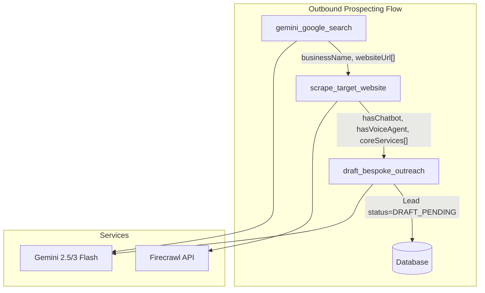

# Outbound Prospecting Engine

## Gold Rush Compliance

**Follow [feature-plan.md](.cursor/plans/outbound_prospecting_engine_feature-plan.md):**

- **Schema first:** No implementation without `clientId` and `leadId` on ProspectQueue.
- **TDD:** Write failing tests before implementation in each phase.
- **Step 02:** Schema migration + failing Vitest (`tests/unit/db/prospect-queue-schema.test.ts`) — must pass before Step 03.

---

## 0. Schema Migration (Prerequisite — MUST complete before any logic)

The existing schema supports the plan. Two additions improve multi-tenant isolation and traceability:

- **ProspectQueue.clientId** (optional): Associate queue items with the tenant who initiated prospecting. Required when creating Leads with correct tenant ownership.
- **ProspectQueue.leadId** (optional, unique): Link queue item to the created Lead after processing. Enables idempotency and traceability.

Add to [prisma/schema.prisma](prisma/schema.prisma):

```prisma
model ProspectQueue {
  id           String      @id @default(uuid())
  clientId     String?     @map("client_id")   // NEW
  leadId       String?     @unique @map("lead_id")  // NEW
  businessName String      @map("business_name")
  websiteUrl   String      @map("website_url")
  status       QueueStatus @default(PENDING)
  attempts     Int         @default(0)
  lastAttemptAt DateTime?  @map("last_attempt_at")
  errorMessage String?     @map("error_message")
  createdAt    DateTime    @default(now()) @map("created_at")
  updatedAt    DateTime    @updatedAt @map("updated_at")

  client Client? @relation(fields: [clientId], references: [id], onDelete: SetNull)
  lead   Lead?   @relation(fields: [leadId], references: [id], onDelete: SetNull)

  @@index([clientId, status])
  @@index([status])
  @@map("prospect_queue")
}
```

On `Client`: add `prospectQueues ProspectQueue[]`  
On `Lead`: add `prospectQueue ProspectQueue?`

Run `bun run prisma migrate dev` with a descriptive migration name.

---

## Architecture Overview




## 1. Dependencies and Environment

- **Add Firecrawl:** `bun add @mendable/firecrawl-js`
- **Env var:** `FIRECRAWL_API_KEY` (document in `.env.example`)
- **Existing:** `@ai-sdk/google`, `ai`, `zod` already in [package.json](package.json)

## 2. Outbound Tools

Create [lib/ai/tools/outbound/](lib/ai/tools/outbound/) (or extend [lib/ai/tools/](lib/ai/tools/)):

### 2.1 gemini_google_search

- **Purpose:** Location + service → structured list of businesses (name, website, etc.)
- **Implementation:** Server action or API route using `generateObject` with `google.tools.googleSearch({})` and a Zod schema, e.g.:

```ts
const BusinessSearchResultSchema = z.object({
  businesses: z.array(z.object({
    businessName: z.string(),
    websiteUrl: z.string().url().optional(),
    address: z.string().optional(),
  })),
});
```

- **Model:** `google('gemini-2.5-flash-lite-preview-09-2025')` (or `gemini-3-flash-preview` if lite not available)

**Prompt:**   
You are a helpful local business search assistant.  
Your task is to find and list 3 businesses that provide plumbing services in durbanville, cape town.  
For each business, you must provide its name, address, and website URL.  
Please ensure the businesses are actively targeting the specified service in the given location.  
Format your response as a numbered list, with each item containing:  
Name: [Business Name]  
Address: [Business Address]  
Website: [Website URL]

Prompt: "You are a helpful local business search assistant. Your task is to find and list 3 businesses that provide {service_name} services in {location}, For each business, you must provide its name, address, and website URL. Please ensure the businesses are actively targeting the specified service in the given location. Format your response as a numbered list, with each item containing: Name: [business_name] Address: [business_address] Website: [website_url]


### 3.2 scrape_target_website

- **Purpose:** URL → canonical scraped data (hasChatbot, hasVoiceAgent, coreServices)
- **Implementation:** Vercel AI SDK `tool()` calling `scraperService.scrapeTargetWebsite(url)`
- **Input schema:** `z.object({ url: z.string().url() })`

**Firecrawl returns domain-specific keys** (e.g. `stratcol_co_za_chatbot`, `stratcol_co_za_core_services`). Use [lib/scraper/normalize-firecrawl-response.ts](lib/scraper/normalize-firecrawl-response.ts) to map to our canonical shape before storing in `Lead.scrapedData`:

```ts
import { normalizeFirecrawlResponse } from "@/lib/scraper";

const raw = await firecrawl.agent({ prompt, schema, urls, model });
const canonical = normalizeFirecrawlResponse(raw.data ?? raw);
// canonical: { hasChatbot, hasVoiceAgent, coreServices: [{ service_name, service_description }] }
```

- **Firecrawl schema:** Use a generic schema that allows domain-specific keys, or a per-URL schema. The normaliser matches by key patterns (`*_chatbot`, `*_voice_agent`, `*_core_services`) and ignores citation keys.
- **Output:** `{ hasChatbot, hasVoiceAgent, coreServices }` (canonical shape)

### 3.3 draft_bespoke_outreach

- **Purpose:** Generate contextual email from `coreServices`, write to DB as draft (never send)
- **Implementation:**
  - Input: `leadId`, `coreServices[]`, `businessName?`
  - Use `generateText` with `google('gemini-3-flash-preview')` (or `gemini-3.1-flash-preview` per [model-router.ts](lib/ai/model-router.ts))
  - Prompt: "Write a professional outreach email for [Business Name] explaining how an AI agent would sell these services: [coreServices]. Use UK English."
  - **Action:** Update `Lead` where `id = leadId`: set `status = DRAFT_PENDING`, `scrapedData = { ...existing, draftSubject, draftBody }`
  - **No SMTP:** Tool only updates DB; no email send capability

## 4. Data Model

- **Lead.scrapedData** (existing JSONB): Store `{ hasChatbot, hasVoiceAgent, coreServices, draftSubject?, draftBody?, websiteUrl?, address? }`
- **ProspectQueue** (after migration): `clientId` for tenant association; `leadId` for queue→Lead linkage; `status` = PENDING → PROCESSING → COMPLETED/FAILED
- **Lead.source:** `OUTBOUND_PROSPECT` when created from outbound flow
- **Lead.status:** `SCRAPED` → `DRAFT_PENDING` after draft_bespoke_outreach
- **Cron flow:** Pass `ProspectQueue.clientId` when creating Leads; set `ProspectQueue.leadId` after Lead creation for idempotency

## 5. Outbound Engine Entry Point

- **Option A:** Cron job at `app/api/cron/outbound/route.ts` that:
  1. Picks `ProspectQueue` entries with `status = PENDING`
  2. Runs `scrape_target_website` → creates/updates Lead with scrapedData
  3. Runs `draft_bespoke_outreach` if `coreServices` present
  4. Updates queue status
- **Option B:** Server action or API route invoked manually (e.g. dashboard "Start prospecting" for a location + service)
- **Recommendation:** Start with Option B (API route) for testing; add cron later.

## 6. Guardrails

### 6.1 Scope Lock (System Prompt)

Add to [lib/ai/system-prompt.ts](lib/ai/system-prompt.ts) or a dedicated outbound prompt:

> "You are a booking and routing assistant for [Business Name]. You must refuse to answer any questions unrelated to scheduling, pricing, or the specific services outlined in your knowledge base. If asked about general knowledge, programming, or unrelated topics, reply strictly with: 'I can only assist with queries related to [Business Name].'"

### 6.2 Commitment Phobia (System Prompt)

> "Never confirm an appointment time until the book_appointment tool has returned a success status. Never invent pricing; if a service cost is not in your knowledge base, state that a custom quote is required."

### 6.3 Human-in-the-Loop (Outbound)

- `draft_bespoke_outreach` **never** sends email; only updates `Lead.status` and `scrapedData`
- Dashboard approval flow before dispatch queue runs (future)

### 6.4 Strict Type Coercion (Zod)

- **capture_lead_details:** Add `z.string().email()` when `email` is provided; `z.string().regex()` for phone (e.g. E.164 or local format). Refactor [lib/ai/tools/capture-lead.ts](lib/ai/tools/capture-lead.ts) to require at least one of email/phone and validate formats.
- **scrape_target_website:** Validate `url` with `z.string().url()`
- **draft_bespoke_outreach:** Validate `leadId` as UUID

## 7. File Structure

```
lib/
  ai/
    tools/
      outbound/
        gemini-google-search.ts
        scrape-target-website.ts
        draft-bespoke-outreach.ts
      index.ts (export outbound tools)
  scraper/
    normalize-firecrawl-response.ts   (map domain-specific keys → canonical shape)
    types.ts
    index.ts
  services/
    scraper.service.ts
app/
  api/
    outbound/
      search/route.ts   (gemini_google_search)
      scrape/route.ts   (scrape_target_website - or tool only)
      draft/route.ts    (draft_bespoke_outreach)
```

## 8. Verification

- **Unit tests:** `normalize-firecrawl-response.test.ts`, `scraper.service.test.ts`, `draft-bespoke-outreach` tool logic
- **Integration:** Mock Firecrawl in tests; no real API calls
- **Build:** `bun run build`
- **Lint:** `bun run lint`

## 9. Inbound Guardrails (Deferred)

- **capture_lead Zod fix:** Add email/phone validation; enforce "at least one of email or phone"
- **System prompt:** Add Scope Lock + Commitment Phobia to `buildSystemPrompt` in [lib/ai/system-prompt.ts](lib/ai/system-prompt.ts)

These can be implemented in a follow-up after the Outbound Engine is stable.