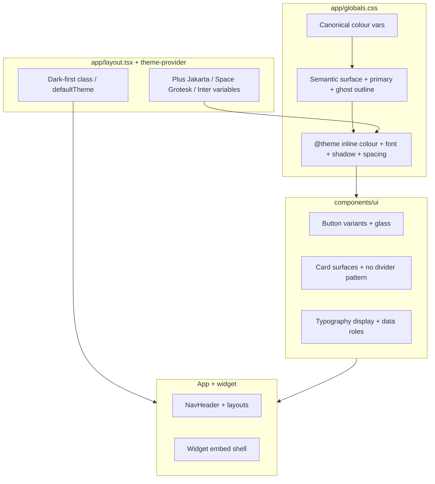

# feat: Design system — High-Performance Unfair Advantage

## Overview

Establish a **dark-first**, mission-control visual language across the Next.js app: **Obsidian Core** surfaces, **Super Agent** neon kinetic accents, **editorial display typography**, **technical data typography**, and **structural boundaries without traditional 1px section borders** (tonal layers, soft gradients, ghost outlines only where accessibility demands). Work is anchored in CSS variables and Tailwind v4 `@theme inline` mappings in `app/globals.css`, with targeted updates to shared primitives (`components/ui/*`), root font loading, and high-traffic chrome — including the **embed/widget** route, which today diverges from the main shell.

## Problem Frame

The product needs a differentiated aesthetic (intentional asymmetry, editorial scale, glass hero surfaces) that cannot be achieved by tweaking a few colour tokens alone. The codebase currently uses a **shadcn-style OKLCH palette**, **Nunito Sans / Lora / Geist Mono**, **class-based dark mode** via `next-themes` with **default `system`**, and **primitives that rely on rings and inherited borders** (for example `components/ui/card.tsx` uses `ring-1`, and `app/globals.css` applies border colour to all elements). Rolling out the new system requires a deliberate **token architecture**, **component boundary strategy**, and **test updates** where RTL tests assert concrete class strings.

## Requirements Trace

- **R1.** **Obsidian palette & hierarchy** — Background `#13121b`, primary kinetic `#fface8`, primary container `#ff24e4`, secondary `#c9bfff`, tertiary container `#ff571a` for gradient stops; surfaces: `surface_container_low` `#1c1b23`, `surface_container` `#201f27`, `surface_bright` `#3a3841`, `surface_variant` `#35343d` at 60% for glass; modal overlay with **20px backdrop blur** on bright surface.
- **R2.** **No-line sectioning** — No traditional 1px solid borders for layout sectioning; use tonal shifts, `surface_container_low` on `background`, `surface` → `surface_container` for context shifts, soft gradient fades for breaks.
- **R3.** **Glassmorphism** — High-priority CTAs and Super Agent cards: semi-transparent `surface_variant` at 60%, `backdrop-filter: blur(12px)` (see verification for token naming in implementation).
- **R4.** **Typography roles** — **Plus Jakarta Sans** display/headlines (`display-lg` 3.5rem, letter-spacing `-0.04em`); **Space Grotesk** labels/data; **Inter** body (`body-lg` 1rem). Copy remains **UK English** (project rule); status copy may reference load-shedding metaphor per brief.
- **R5.** **Elevation** — Tinted ambient glow shadows (primary-tinted), not grey/black-only shadows; ghost border fallback `outline_variant` `#574050` at **15% opacity** when a visible edge is required for accessibility.
- **R6.** **Components** — Super Agent primary button: gradient primary → primary container, `border-radius: 0.5rem`, hover intensifies surface tint; secondary button: `surface_container_high`-style background with `on_surface` text. Cards: **no divider lines**; use **80px** vertical spacing from the spacing scale or tonal shifts; **asymmetric padding** (e.g. `pl-12 pr-6`) for motion.
- **R7.** **Status indicators** — Active: pulsing primary glow; offline/standby: `surface_container_highest` plus ghost outline; system status may show load-shedding stage copy as specified in the brief.
- **R8.** **Do/Don’t guardrails** — Links use **secondary** (`#c9bfff`), not default blue; avoid rigid centring where asymmetry is intentional; avoid bottom-only shadows in favour of ambient glow.

## Scope Boundaries

- **In scope:** Design tokens, global CSS, font loading, shared UI primitives most routes consume, key navigation chrome, and explicit embed/widget alignment strategy.
- **Out of scope (this plan):** Full marketing site art direction rewrite, data-viz library adoption, or screenshot-based visual regression tooling — unless raised during implementation as a follow-up.
- **Non-goals:** Changing product functionality, API contracts, or business logic beyond what is required for theming and display.

## Context & Research

### Relevant Code and Patterns

- **Tokens & Tailwind v4:** `app/globals.css` — `:root` / `.dark` variables, `@theme inline` mapping to `--color-*`, `@layer base` applies `border-border` to `*` (conflicts with R2; must be redesigned carefully).
- **Theme:** `components/theme-provider.tsx`, `app/layout.tsx` — `ThemeProvider` with `attribute="class"`, `defaultTheme="system"`; fonts: **Nunito Sans**, **Lora**, **Geist Mono** today — to be replaced or remapped per R4.
- **Primitives:** `components/ui/button.tsx`, `components/ui/button-variants.ts`, `components/ui/card.tsx` (uses `ring-1 ring-foreground/10`), other shadcn/Base UI components consuming `border`, `bg-card`, `text-muted-foreground`.
- **Typography rule:** `.cursor/rules/typography-components.mdc` — all user-facing text through `@/components/ui/typography` where applicable; `components/ui/typography.tsx` maps sizes to Tailwind classes.
- **Tests locking classes:** `tests/components/ui/typography.test.tsx`, `tests/components/ui/button.test.tsx` — must be updated when class strings change.
- **Widget:** `app/widget/[clientId]/layout.tsx` (and related) — reported **light/divergent** shell; must be included in cross-surface parity.

### Institutional Learnings

- **Chat markdown / theme-aware classes:** `docs/solutions/ui-bugs/chat-widget-markdown-links.md` — prefer theme semantic classes (`text-primary`, `bg-muted`) for rendered markdown inside bubbles so token changes propagate.
- **Playwright locators:** `docs/solutions/integration-issues/playwright-strict-mode-ambiguous-locator-widget-e2e-20260316.md` — after layout/header changes, scope locators (e.g. `main header`) to avoid ambiguous `<header>` matches.

### External References

- Tailwind CSS v4 **CSS-first configuration** and `@theme` — project already uses `@import "tailwindcss"` and `@theme inline` (local pattern is authoritative; consult upstream docs when adding new semantic colours or font families).

## Key Technical Decisions

- **Token model (semantic vs raw hex):** Map the brief’s hex values into **CSS custom properties** first, then expose **semantic names** (`--background`, `--surface-container-low`, `--primary`, `--outline-ghost`, etc.) through `@theme inline` so components use **`bg-background` / `bg-card`** style utilities rather than arbitrary hex in JSX. *Rationale:* Keeps shadcn-style consumption, simplifies dark-first rollout, and avoids scattering literals. *Tradeoff:* Brief uses named Material-like tiers; the repo uses shadcn names (`card`, `muted`); either **extend** the theme with new semantic keys or **document a mapping table** from brief names → existing keys plus new keys — pick one mapping and apply consistently (avoid dual naming in components).

- **Dark-first default:** Set the root theme default to **dark** (and/or ensure HTML carries `class="dark"` for the main product) so “Obsidian Core” is the default experience; keep `next-themes` for user override if the mode toggle remains. *Rationale:* Matches creative north star; reduces flash of light theme. *Tradeoff:* Verify contrast for auth and marketing pages if they share the root layout.

- **“No-line” rule vs accessibility:** Replace decorative borders with tonal surfaces and glows; where focus rings or boundaries are **required** (WCAG, keyboard focus), use **ghost outline** (R5) or focus-visible rings derived from `--ring` / `--outline-ghost`, not full-opacity 1px boxes. *Rationale:* Satisfies both R2 and a11y. *Rejected:* Removing all outlines without replacement — would harm keyboard users.

- **Universal `* { border-border }`:** The current base layer applies border colour globally. **Revisit** so structural “lines” are not the default (may switch to `border-transparent` / zero width by default and opt-in borders on inputs only, or remove global border application). *Rationale:* Directly conflicts with R2; must be resolved early to avoid fighting utilities.

- **Font loading:** Use `next/font/google` (or agreed subset strategy) for **Plus Jakarta Sans**, **Space Grotesk**, and **Inter**; wire CSS variables `--font-display`, `--font-mono` or dedicated **label** slot, and `--font-sans` for body — align with `@theme inline` font families. *Rationale:* Performance and CLS control; matches existing pattern.

- **Card separation (80px):** Encode **80px** as a **theme spacing step** (e.g. `--spacing-section` or extend spacing scale) rather than only arbitrary values, so “High-Performance Cards” stay consistent. *Rationale:* Repeatable layout token.

## Open Questions

### Resolved During Planning

- **Q: Is there a brainstorm requirements doc?** None found under `docs/brainstorms/*-requirements.md` for this topic; this plan uses the user-provided brief as the requirements source.
- **Q: Where do OKLCH vs hex land?** Current codebase uses OKLCH in `globals.css`; brief specifies hex. **Resolution:** Store canonical colours in a form that meets contrast goals — either convert brief hex to OKLCH for consistency with existing tokens, or keep hex in variables — implementer chooses based on visual match and pipeline consistency, documented in token comments.

### Deferred to Implementation

- **Exact semantic token naming** for every Material-like name in the brief (`surface_container_highest`, etc.) vs extending shadcn’s existing scale — finalise after auditing all `bg-*` / `border-*` usages.
- **Whether marketing routes** need a lighter variant or share the same dark shell — product decision if stakeholders want a split theme.
- **Pulsing “active” animation** implementation detail (CSS keyframes vs Tailwind animate plugin) — pick during build for performance.

## High-Level Technical Design

> *This illustrates the intended approach and is directional guidance for review, not implementation specification. The implementing agent should treat it as context, not code to reproduce.*

**Layer stack (R1–R2):** Base `background` → section `surface_container_low` → card `surface_container` → elevated modal `surface_bright` + heavy backdrop blur; “glass” nodes sit as a **semi-transparent** layer with blur over lower tiers.

## Implementation Units

- [ ] **Unit 1: Token architecture and global theme mapping**

**Goal:** Define Obsidian / Super Agent palette, surface tiers, ghost outline, tinted shadow, gradient stops, and optional spacing token for **80px** section gaps; expose through `@theme inline` for Tailwind utilities.

**Requirements:** R1, R2, R5, R8 (link colour available as token).

**Dependencies:** None.

**Files:**
- Modify: `app/globals.css`
- Test: `tests/unit/` — add **`tests/unit/theme/tokens.test.ts`** (or colocate with existing unit test layout) asserting CSS variable names exist / key colours parse — *if* the repo pattern allows reading computed theme without a browser; otherwise **Test expectation: none — token verification via build + visual smoke** until a stable test harness exists.

**Approach:**
- Add semantic variables for surface ladder, primary/secondary/tertiary gradient stops, `--outline-ghost` from R5, and ambient shadow tokens.
- Document brief → variable mapping in comments (UK English).
- Reconcile `:root` vs `.dark`: for **dark-first**, consider making the **default** shell match Obsidian without requiring users to toggle (implementation detail in Unit 2).

**Patterns to follow:**
- Existing `@theme inline` block in `app/globals.css`.

**Test scenarios:**
- **Happy path:** Build completes with new variables present; no duplicate `--color-*` conflicts in `@theme inline`.
- **Edge case:** `.dark` and default shell both yield readable `foreground` on `background` for body text (spot-check contrast in implementation).
- **Integration:** Any consumer using `bg-background` / `text-foreground` still renders after token rename (smoke via Storybook only if present — **not required**; use app route smoke in Unit 6 if needed).

**Verification:**
- `bun run build` succeeds; primary/secondary utilities resolve; surfaces are distinguishable without relying on 1px section borders.

---

- [ ] **Unit 2: Dark-first shell and font loading**

**Goal:** Load **Plus Jakarta Sans**, **Space Grotesk**, and **Inter**; wire CSS variables for display, sans, and “technical” roles; set **dark-first** theme defaults compatible with `next-themes`.

**Requirements:** R4, dark-first alignment with R1.

**Dependencies:** Unit 1 (font variables slot into theme).

**Files:**
- Modify: `app/layout.tsx`
- Modify: `components/theme-provider.tsx` (only if default props need changing)
- Modify: `app/globals.css` (`@theme inline` font family mappings, `html`/`body` font application rules)
- Test: **Test expectation: none — font wiring** unless adding a small unit test for exported font variable names; prefer manual/build verification.

**Approach:**
- Replace or repurpose existing **Nunito Sans / Lora / Geist Mono** variables — ensure **no unused font downloads** remain.
- Map **Typography** roles: display/headlines → Plus Jakarta; body → Inter; labels/metrics → Space Grotesk (may require new `Typography` subcomponents or variants in Unit 4).

**Patterns to follow:**
- Next.js `next/font/google` pattern already in `app/layout.tsx`.

**Test scenarios:**
- **Happy path:** Root layout applies `font-sans` to body as Inter; display elements use display family when Typography variants updated.
- **Edge case:** `suppressHydrationWarning` on `html` remains correct when theme class toggles.

**Verification:**
- No CLS regression obvious on main routes; fonts load without 404; theme defaults to dark appearance for new sessions (per decision).

---

- [ ] **Unit 3: Structural boundaries — base layer, cards, inputs**

**Goal:** Align with **no-line sectioning**: remove reliance on default borders/rings for cards and structural splits; adopt tonal contrast, glow, and ghost outlines for required edges.

**Requirements:** R2, R5, R6 (card rules), R8.

**Dependencies:** Unit 1–2.

**Files:**
- Modify: `app/globals.css` (`@layer base` `*` rule)
- Modify: `components/ui/card.tsx` (and `card-header` / related if they assume borders)
- Modify: `components/ui/button-variants.ts`, `components/ui/button.tsx`
- Modify: `components/ui/input.tsx`, `components/ui/separator.tsx` (if used as divider — evaluate **removal or replacement** with spacing)
- Test: `tests/components/ui/button.test.tsx`; add or extend **`tests/components/ui/card.test.tsx`** if absent

**Approach:**
- Replace `ring-1` card treatment with **surface tier + shadow/glow** per brief; use **80px** gap token between stacked sections where cards represent sections.
- Primary button: **gradient** from primary to primary-container tokens; **8px** radius (`0.5rem`); hover state increases tint intensity (token-driven).
- Secondary button: container-high background, on-surface text.
- Resolve **global border** application: move to opt-in borders for form controls only.

**Execution note:** Expect **RTL class-string updates** in existing tests; run tests after edits per project testing rules.

**Patterns to follow:**
- `buttonVariants` CVA pattern in `components/ui/button-variants.ts`.

**Test scenarios:**
- **Happy path:** Card renders without `ring-1` / without divider borders between logical groups; primary button shows gradient utility classes or token-backed styles.
- **Edge case:** Focus-visible still visible on button and inputs (keyboard navigation).
- **Error path:** Disabled and loading states remain visually distinct without relying on grey borders only.

**Verification:**
- Card and button tests green; no unstyled interactive controls.

---

- [ ] **Unit 4: Typography system — editorial and technical roles**

**Goal:** Implement **display-lg** (3.5rem, `-0.04em` tracking), **body-lg** (1rem), and **Space Grotesk** for technical/label/data roles via `components/ui/typography.tsx`.

**Requirements:** R4, R6 (large metric anchors — support in Typography or documented pattern).

**Dependencies:** Unit 2.

**Files:**
- Modify: `components/ui/typography.tsx`
- Modify: `tests/components/ui/typography.test.tsx`

**Approach:**
- Introduce variants or subcomponents that map font families and sizes to the brief without breaking existing call sites — prefer **additive** APIs if wide usage exists.
- Ensure **UK English** in any default strings (status copy handled in Unit 5).

**Patterns to follow:**
- `.cursor/rules/typography-components.mdc` — do not introduce raw `<h1 className="...">` in feature pages; migrate call sites opportunistically when touching files.

**Test scenarios:**
- **Happy path:** `Typography.H1` (or display variant) applies display font and tracking; body uses Inter; technical label uses Space Grotesk.
- **Edge case:** Long headlines wrap without clipping; `className` merge still works via `cn()`.
- **Integration:** One marketing or dashboard page updated to use new display variant to prove end-to-end (optional within unit if timeboxed).

**Verification:**
- `tests/components/ui/typography.test.tsx` passes with updated expectations; no `any` types.

---

- [ ] **Unit 5: Chrome, status patterns, and link colour**

**Goal:** Apply new tokens to **navigation/header**, system status metaphors (load-shedding stage copy per brief), **link** styling to **secondary** (`#c9bfff`), and **pulsing active** / **standby** treatments.

**Requirements:** R7, R8, R3 (glass on hero priority surfaces where used in chrome).

**Dependencies:** Unit 1–4.

**Files:**
- Modify: `components/shared/nav-header.tsx`
- Modify: relevant **status** / **dashboard** components (search codebase for `Status`, `Badge`, system health UIs)
- Modify: `app/globals.css` or `components/ui/` link styles if links use `text-primary` incorrectly

**Approach:**
- Replace default blue link styling with **secondary** token utilities.
- Implement pulsing glow via CSS animation token (scoped to avoid motion sensitivity — consider `prefers-reduced-motion`).

**Patterns to follow:**
- Typography components for visible strings; UK English.

**Test scenarios:**
- **Happy path:** Nav links render in secondary colour; active status shows pulsing treatment when `prefers-reduced-motion: no-preference`.
- **Edge case:** Reduced motion disables pulse but keeps colour/state distinction.
- **Integration:** Nav remains usable on mobile breakpoints (existing responsive behaviour preserved).

**Verification:**
- Key routes using NavHeader render correctly; no unreadable contrast on Obsidian background.

---

- [ ] **Unit 6: Widget/embed parity and cross-surface smoke**

**Goal:** Align **widget** shell with the design system (today diverges, e.g. light backgrounds) or document **explicit** exceptions with rationale.

**Requirements:** R1–R3, cross-surface consistency.

**Dependencies:** Unit 1–3 minimum.

**Files:**
- Modify: `app/widget/[clientId]/layout.tsx` (and related widget components as needed)
- Modify: `tests/e2e/**` only if a smoke assertion is added — **scoped locators** per institutional learning

**Approach:**
- Decide single embed background strategy (Obsidian + glass vs forced light for third-party sites) — **default to brand Obsidian** unless embed readability on arbitrary host pages forces a light variant (if so, record in deferred notes).

**Patterns to follow:**
- `docs/solutions/integration-issues/playwright-strict-mode-ambiguous-locator-widget-e2e-20260316.md` for locator scoping.

**Test scenarios:**
- **Integration:** Widget route loads without visual regression of chat functionality; markdown bubbles still use theme-aware classes per `docs/solutions/ui-bugs/chat-widget-markdown-links.md`.
- **Happy path:** Widget background/spacing matches token stack or approved exception.

**Verification:**
- Targeted Playwright or manual verification on widget route; no ambiguous header locators in updated tests.

---

## System-Wide Impact

- **Interaction graph:** `ThemeProvider` → all pages; `NavHeader` → all root-layout routes; Clerk/auth UI may inherit global styles; **AI chat** bubbles (`components/ai-elements/*`, Streamdown) inherit semantic colours — re-verify markdown link styles after token change.
- **Error propagation:** Theming changes should not alter server actions or API behaviour; if any client component reads `resolvedTheme`, ensure null-safe handling remains.
- **State lifecycle risks:** Theme flash on load — mitigate with `defaultTheme` + `suppressHydrationWarning` patterns already present.
- **API surface parity:** None for HTTP APIs; **CSS variable names** are the implicit contract for future components — document in code comments.
- **Integration coverage:** Widget embed + main app + portal/dashboard layouts should be smoke-tested; unit tests alone cannot prove blur/backdrop behaviour.
- **Unchanged invariants:** Business logic, Prisma schema, and route handlers stay unchanged unless a bug is discovered during UI work.

## Risks & Dependencies

| Risk | Mitigation |
|------|------------|
| WCAG contrast failures on neon pink/lavender on obsidian | Run contrast checks on primary/secondary text pairs; adjust OKLCH/lightness while keeping brand intent |
| Performance cost of blur/glass everywhere | Restrict blur to hero/CTA surfaces; use `will-change` sparingly |
| RTL tests break widely when classes change | Update tests in the same PR as component changes; run targeted `bun run test` |
| Embed on unknown host sites looks wrong on dark | Optional exception path or host-detection deferred; document decision |
| `border-border` removal breaks form fields | Keep explicit input borders or focus rings for usability |

## Documentation / Operational Notes

- No new markdown doc required unless the team wants a `docs/design-system.md` — **out of scope unless requested** (user rule: avoid extra markdown unless asked). Prefer **inline comments** in `app/globals.css` for token mapping.
- Update **Living SOP** only if the repo mandates UI standards there — check `docs/living-sop.md` during implementation if required by `verify` skill.

## Sources & References

- **Origin document:** none (requirements supplied in user brief for this planning session)
- Related code: `app/globals.css`, `app/layout.tsx`, `components/ui/button-variants.ts`, `components/ui/card.tsx`, `components/ui/typography.tsx`
- Institutional: `docs/solutions/ui-bugs/chat-widget-markdown-links.md`, `docs/solutions/integration-issues/playwright-strict-mode-ambiguous-locator-widget-e2e-20260316.md`

---

## Confidence check (auto)

**Strengthening applied:** **Key Technical Decisions** (token mapping tradeoffs, dark-first, border strategy), **Implementation Units** (explicit files, test hooks, dependencies), **System-Wide Impact** (chat/embed, theme flash), **Risks** (contrast, blur cost, tests).

**Document review (coherence pass):** Requirements R1–R8 trace to units; scope boundaries explicit; deferred items are implementation-time naming and marketing split-theme. No product blocker identified.

Plan written to `docs/plans/2026-04-07-001-feat-design-system-unfair-advantage-plan.md`.
